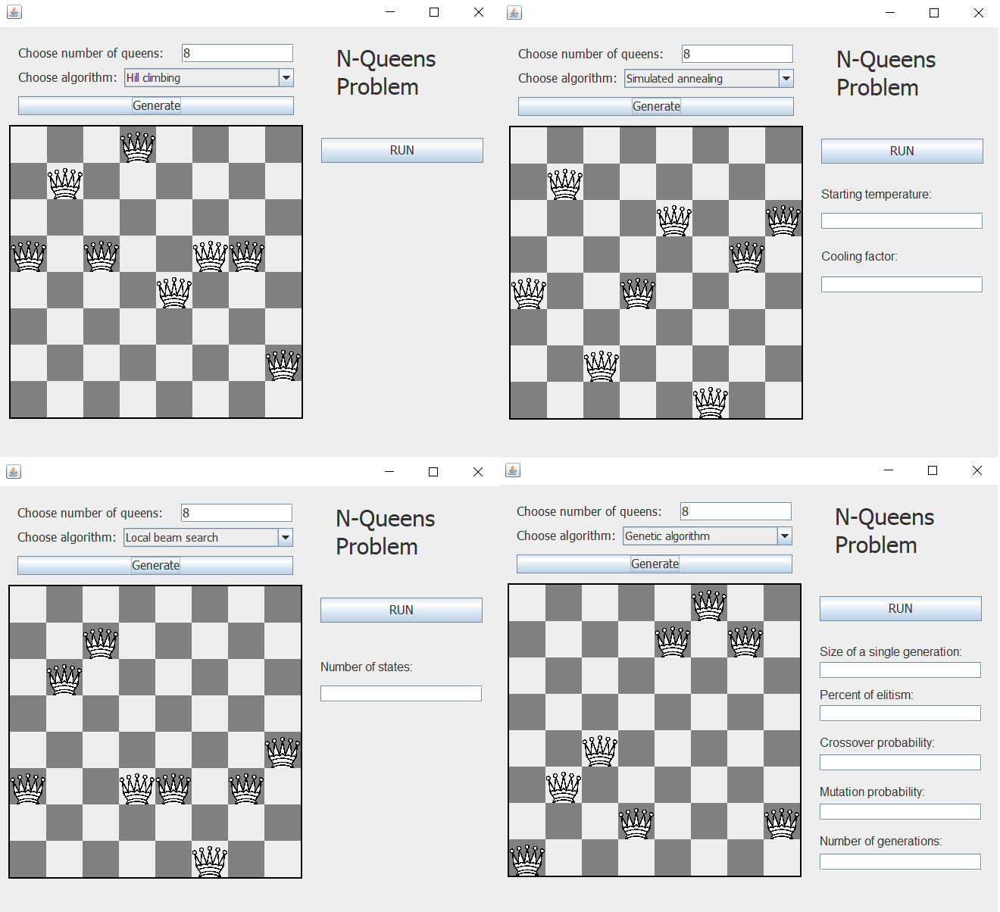

# N-Queens Problem

N-Queens is a combinatorial problem based on chess. Regarding queens can attack vertically, horizontally, and diagonally in chess, N-Queens problem asks:

`How can N queens placed on an NxN chessboard so that no two of them attacks each other?`

This project demonstrates the n-queens problem solution and solves them via **Hill Climbing**, **Simulated Annealing**, **Local Beam Search**, and **Genetic Algorithm**.

## Demonstration

## Parameters

### General
* `Number of queens`: Number of queens in chessboard. Namely, **N**.

**Note:** Starts with a random state(chessboard configuration).

### Hill Climbing
The hill climbing algorithm gets its name from the metaphor of climbing a hill.

**Note:** If gets stuck at local maxima, randomizes the state.

### Simulated Annealing
The annealing algorithm attempts to tease out the correct solution by making risky moves at first and slowly making more conservative moves.

* `Temperature`: The starting temperature that affects the annealing move(randomizing). If temperature is high, the state acts more randomly(anneals). And vice versa. 
* `Cooling factor`: The cooling parameter that reduces the temperature parameter.

### Local beam search

* `Number of states`: Number of states in beam

### Genetic Algorithm
Evolution-like algorithm that suggests the survival of the best ones from many combinated&unified population in each generation.

* `Size of a single generation`: Size of a single generation.
* `Percent of elitism`: Percent of chromosome which is not going to be mutated in each generation.
* `Crossover probability`: Probability of occurance of crossover in each generation.
* `Mutation probability`: Probability of occurance of mutation in each generation.
* `Number of generations`: The number of iterations to get solution.
